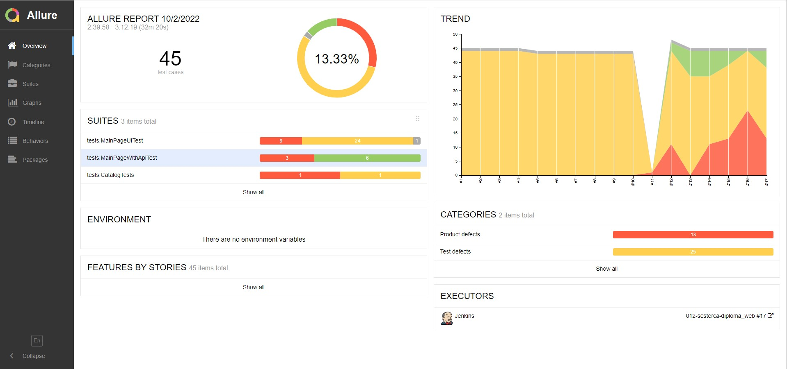
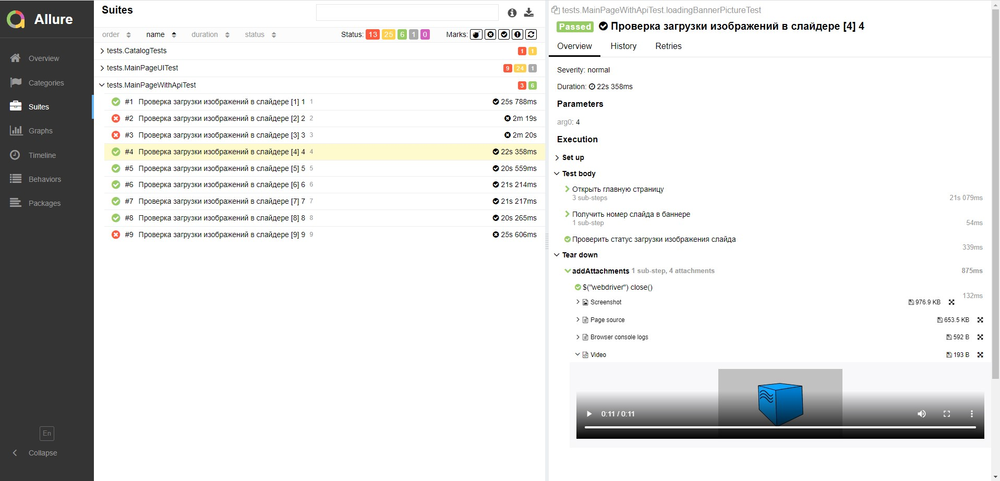
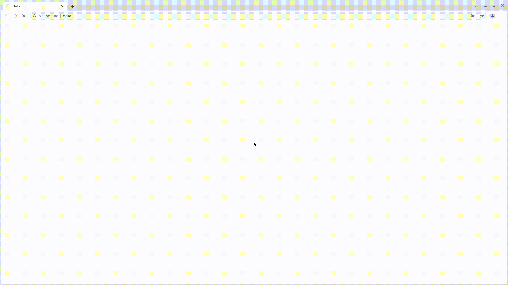
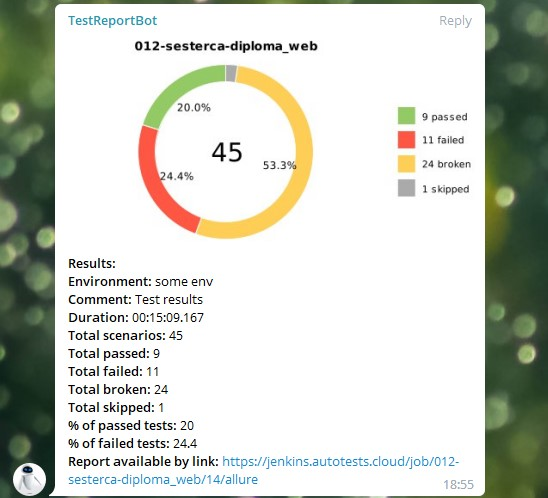

# Тестирование UI сайта компании
[](https://4fresh.ru/)

*[4fresh](https://4fresh.ru/about/why/) первый мультибрендовый интернет-магазин натуральной косметики и органической косметики ручной работы.* 

### В проекте протестировано :mag_right:
* Переходы по пунктам меню хедера
* Показ подменю и его структура при наведении курсора на пункт меню хедера
* Проверка автоопределения геопозиции
* Проверка отображения только товаров со скидкой в блоке Распродажа
* Проверка загрузки логотипов брендов
* Проверка загрузки изображений в слайдере
* Проверка счетчика после добавления товара в Избранное
* Проверка добавления в Избранное 

### В проекте использованы :gear:


## Для запуска тестов
### локально в терминале :computer:
```
gradle clean test -Dhost=local
```
### удаленно в Jenkins :desktop_computer:
```
gradle clean test -Dhost=remote
-Dbrowser=${BROWSER}
-DbrowserSize=${BROWSER_SIZE}
-DbaseUrl="${BASE_URL}"
```
[Пример сборки](https://jenkins.autotests.cloud/job/012-sesterca-diploma_web/16/)
Открыть [Jenkins](https://jenkins.autotests.cloud/job/012-sesterca-diploma_web/), в меню слева выбрать ```Собрать с параметрами```
#### Параметры сборки
<details><summary>BROWSER</summary><p>Браузер, в котором будут выполняться тесты (по умолчанию <strong>Chrome</strong>)</p></details> 
<details><summary>BROWSER_SIZE</summary><p>Размер окна браузера (по умолчанию <strong>1920х1080</strong>)</p></details>
<details><summary>BASE_URL</summary><p>Адрес тестового окружения (по умолчанию <strong>[https://4fresh.ru/]</strong>)</p></details>
<details><summary>REMOTE</summary><p>Адрес удаленного сервера, на котором будут запускаться тесты (по умолчанию <strong>selenoid.autotests.cloud</strong>)</p></details>

## Для просмотра отчета
Под названием проекта кликнуть []
#### Главный экран отчета


#### Экран подробного просмотра тестов тест-сьюта


#### Пример выполнения теста


## Для уведомления о результатах тестирования

